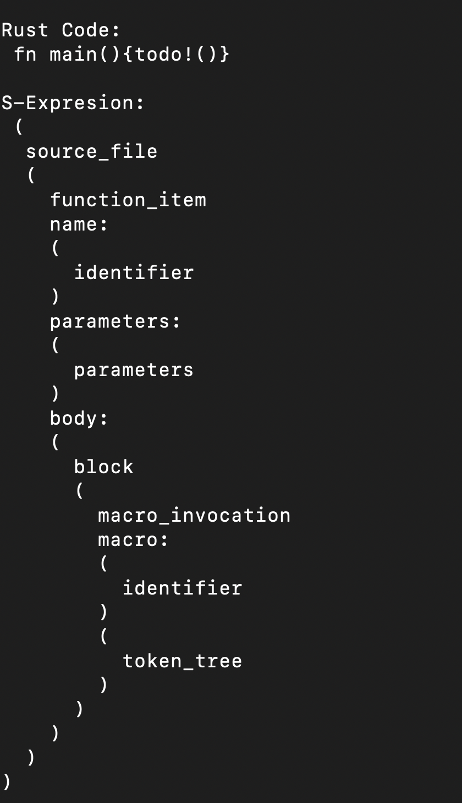

# Tree sitter for rust program

This is a list of `s-expressions` and the corresponding captured rust code.

---

Ex. To parse Macro Identifiers

```rust
#[derive(Accounts)]
#[instruction(fee: u32, tick_spacing: u16)]
pub struct EnableFeeAmount<'info> {
    /// Valid protocol owner
    #[account(mut, address = factory_state.load()?.owner)]
    pub owner: Signer<'info>,

    /// Factory state stores the protocol owner address
    #[account(mut)]
    pub factory_state: AccountLoader<'info, FactoryState>,

    /// Initialize an account to store new fee tier and tick spacing
    /// Fees are paid by owner
    #[account(
        init,
        seeds = [FEE_SEED.as_bytes(), &fee.to_be_bytes()],
        bump,
        payer = owner,
        space = 8 + size_of::<FeeState>()
    )]
    pub fee_state: AccountLoader<'info, FeeState>,

    /// To create a new program account
    pub system_program: Program<'info, System>,
}
```

```js
// `rustFunc` is rust code.
const tree = parser.parse(rustFunc);

const parser = new Parser();
parser.setLanguage(Rust);

const attributeItems = new Query(Rust, expression); // expression from the table below
const ast = capturesByName(
  tree,
  attributeItems,
  "attributeItem" // @name tagged with the expressions to group output
);
```

Will get us this

```js
[
  { text: "#[derive(Accounts)]", row: 1, column: 0 },
  {
    text: "#[instruction(fee: u32, tick_spacing: u16)]",
    row: 2,
    column: 0,
  },
  {
    text: "#[account(mut, address = factory_state.load()?.owner)]",
    row: 5,
    column: 4,
  },
  { text: "#[account(mut)]", row: 9, column: 4 },
  {
    text:
      "#[account(\n" +
      "        init,\n" +
      "        seeds = [FEE_SEED.as_bytes(), &fee.to_be_bytes()],\n" +
      "        bump,\n" +
      "        payer = owner,\n" +
      "        space = 8 + size_of::<FeeState>()\n" +
      "    )]",
    row: 14,
    column: 4,
  },
];
```

---

# List of S-Expressions

| Type                  | Expression                                                                                                     |
| --------------------- | -------------------------------------------------------------------------------------------------------------- |
| Macro Identifier      | `(macro_invocation macro: (identifier)) @macroIdentifier`                                                      |
| Use Declaration       | `((use_declaration argument: (use_wildcard) )) @use`                                                           |
| Let Declaration       | `(let_declaration pattern: _ value: _) @letDeclaration`                                                        |
| Assignment Expression | `(assignment_expression left: _ right: _) @assignment`                                                         |
| Functions             | `(function_item (visibility_modifier) name: (identifier) parameters: _ return_type: _ body: _) @functionBlock` |
| Attributes            | `(attribute_item)@attributeItem`                                                                               |
| Modules               | `(mod_item name: _) @modeItem`                                                                                 |
| Structs               | `(struct_item name: _ body: _) @structItem`                                                                    |

---

`indentSExpr` function in `sexprParser.ts` will format the s-expression for better readability.


